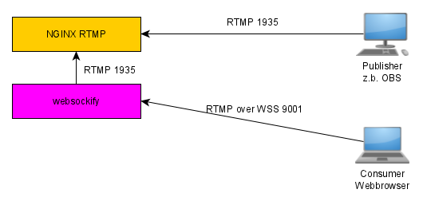
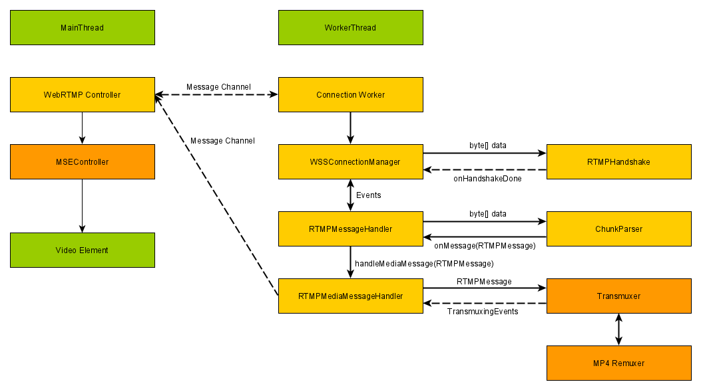

WebRTMP
======
A HTML5 Flash Video (RTMP) Player written in pure JavaScript without Flash. LONG LIVE RTMP ;-)

For those who really miss RTMP in Browser, cause HLS sucks.

### heavily inspired bei bilibi`s [FlvPlayer](https://github.com/bilibili/flv.js)


## Introduction
This project consists of 2 parts. 
- Websockify for wrapping WSS to TCP
- WebRTMP Client library 


## Demo
[https://bunkertv.org/webrtmp/index.html](https://bunkertv.org/webrtmp/index.html)

## Features
- RTMP container with H.264 + AAC / MP3 codec playback
- RTMP over Websocket low latency live stream playback <= 2 sec.
- Compatible with Chrome, FireFox, Safari 10, IE11 and Edge
- Extremely low overhead and hardware accelerated by your browser!
- Use of promises


## Getting Started
### ClientSide:
```html
<script src="dist/webrtmp.js"></script>
<video id="videoElement"></video>
<script>
    const videoElement = document.getElementById('videoElement');
    
    webrtmp.attachMediaElement(videoElement);
    
    webrtmp.open(document.location.host, 9001).then(()=>{ // Host, Port of WebRTMP Proxy
        webrtmp.connect("demo").then(()=>{                // Application name  
            webrtmp.play("your streanname").then(()=>{    // Stream name
                console.log("playing");
            })
        })
    })

</script>
```


### ServerSide:
Prerequisites:
```bash
apt install websockify
```
Launch WSS RTMP-Wrapper
(Don't forget to get certificates)
```bash
websockify -D --cert /home/bunkertv/certs/fullchain.pem --key /home/bunkertv/certs/privkey.pem --ssl-only 9001 127.0.0.1:1935
```

## State
proof-of-concept

## TODO
a lot of error and exception handling

## Design
#### serverSide


#### ClientSide

